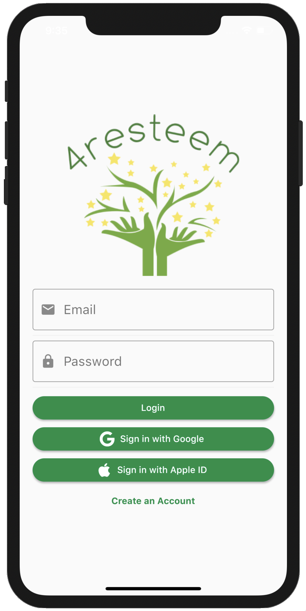
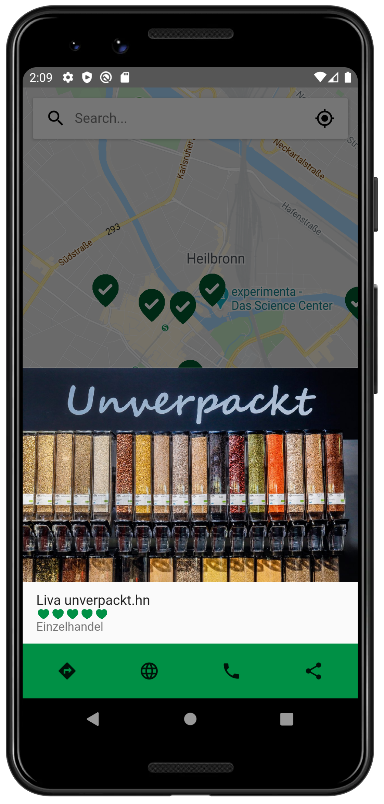
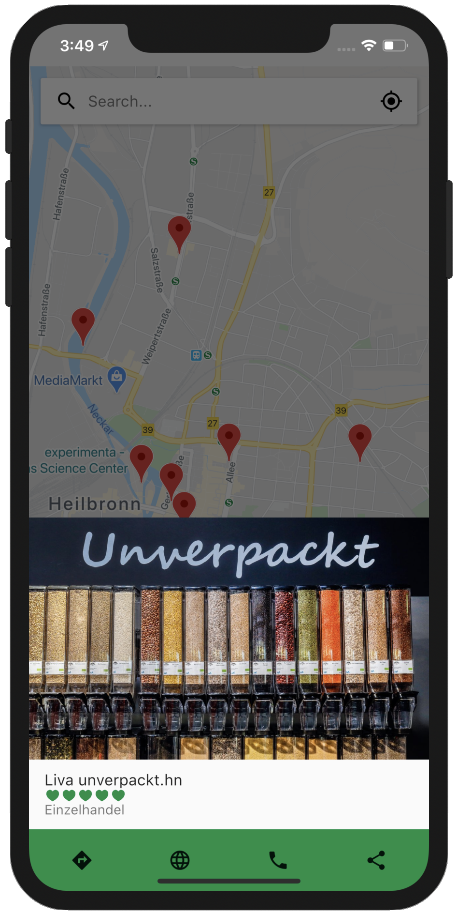
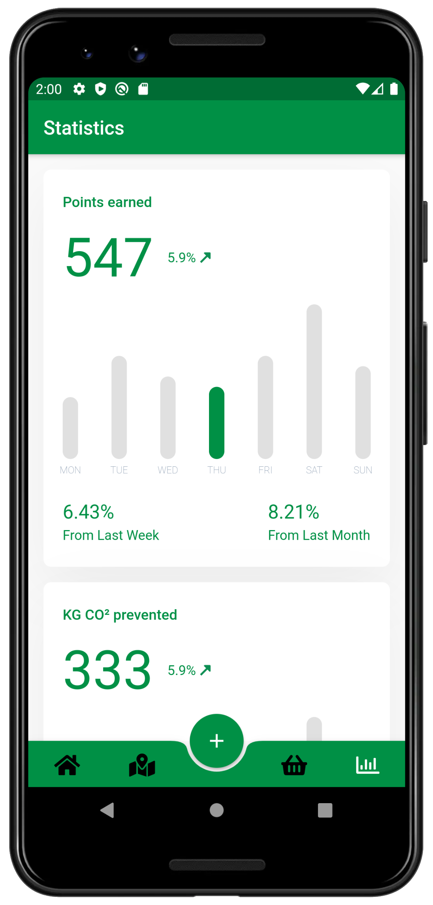
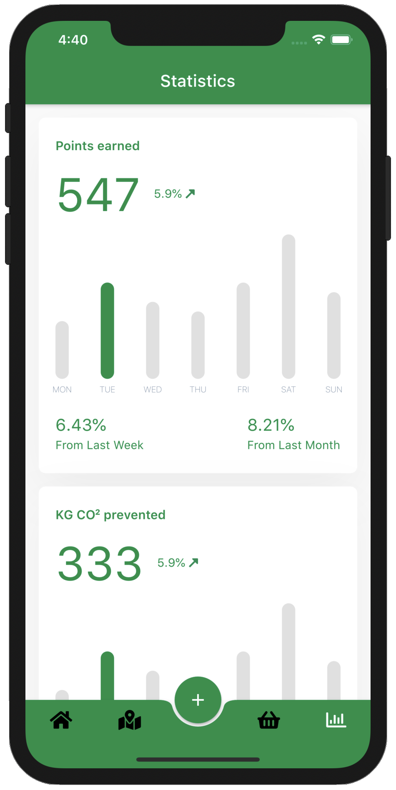

# 4resteem

4resteem entstand im Rahmen der Umwelt Challenge des Campus Cup an der Hochschule Heilbronn im Sommersemester 2020.  

Der Campus Cups ist eine Art Startup Simulation bei der in interdisziplinären Teams aus je drei Studierende aus dem Bereich International Buisness Master und drei Studierende aus der Fakultät für Informatik innerhalb eines Semsters eine App zu einem Thema planen und entwickeln. Hierzu zählt neben dem Prototypen der App auch ein kompletter Businessplan.

**4resteem** ist ein Kunstwort aus Forest und Esteem. 4resteem steht für die Wertschätzung des Waldes und der Umwelt.

Ziel unserer App war es eine App zu entwickeln, bei der Nutzer bei ausgewählten Läden die ausschließlich auf regionale und nachhaltige Produkte setzen Punkte zu sammeln und diese als Rabattgutscheine für ihren nächten Einkauf in einem Partnershop verwenden können.  
Ebenfalls gibt es nicht nur Punkte für die gekauften Produkte sondern auch für die Anfahrt ohne Auto und den Verzischt auf eine Plastiktüte, sei es für Obst und Gemüse oder den gesamten Einkauf.  

Auf der Startseite der App gibt es dazu verschiedene Herausforderungen für die der Nutzer Punkte bekommen kann. Hierzu zählt z.B. drei mal die Woche mit OPNV oder dem Fahrrad oder zu Fuß zur Arbeit zu gehen. 

Nach jedem Einkauf kann dazu der Kassenzettel eingescannt werden und die Punkte werden auf dem Nutzerkonto gutgeschrieben. Mit diesen Punkten können in der App Gutscheine von Partnern erworben werden die dann beim Einkauf vorgezeigt, eingescannt und eingelöst werden können.

Neben dem Sammeln und einlösen von Punkten werden den Nutzern auch Partnershops in einer Karte angezeigt, inklusive Bewertung und Kathegorie. Von hier aus kann schnell zum Shop navigiert werden, die Website des Shops gefunden werden, ein Anruf getätigt oder mit einem Freund geteilt werden.

Des weiteren erhält der Nutzer eine Statistik über seine Punkte in der aktuellen Woche und eine Übersicht wie viel CO2 durch sein Verhalten gegenüber einer durchschnittlichen Person in Deutschland eingespart wurde. 

## Screenshots

Login Screen mit der möglichkeit sich über Apple oder Google einzuloggen. Da das Design des Button nicht mit den Apple Design Guidelines übereinstimmt wäre so ein Release im Appstore leider nicht möglich und es muss diesen angepasst werden.

  

Karte mit Partershops. Nach der Auswahl eines Partners kann dessen Bewertung und Bild eingesehen werden sowie die Website des Partners geöffnet, ein Anruf getätigt, mit einer App der Wahl geteilt oder zum Partner navigiert werden.

  

Statistik über die Anzahl der Punkte die in der Woche verdient wurden und der Unterschied zur letzten Woche und Monat.  
Darüber Hinaus die Menge an CO2 die gegenüber dem durchschnitt aller Bürger in Deutschland durch das angepasste Verhalten eingespart wurde.

  

Übersicht der Einstellungen der App.

  

Barcode-Scan um dem Code auf der Rückseite des Kassenzettel oder dem Display an der Kasse zu scannen um die Punkte bei jedem Einkauf gutgeschrieben zu bekommen.

  